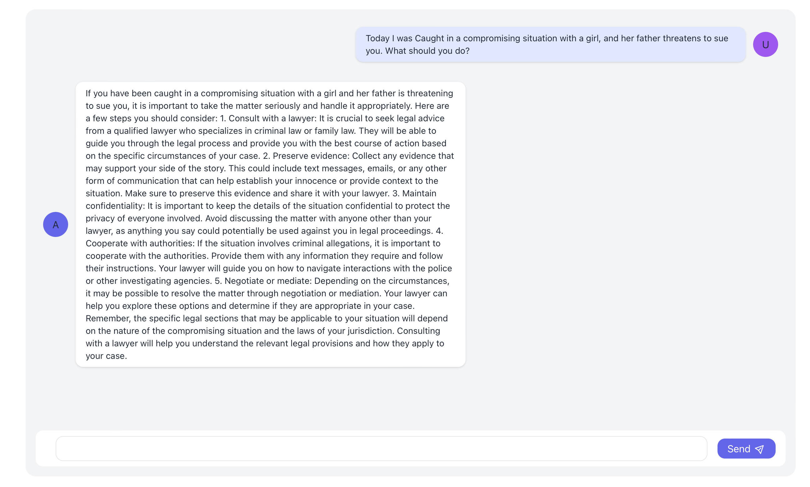
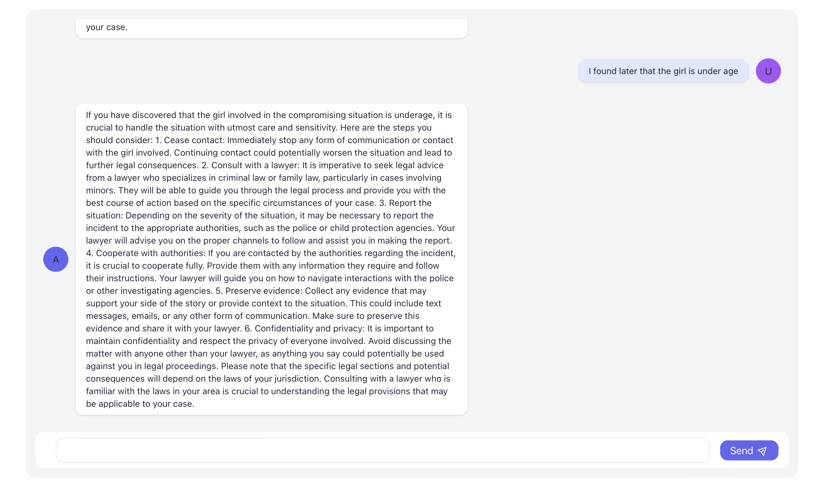

# Indian Layer Chatbot


The Indian Layer Chatbot is an AI-powered conversational agent developed using the OpenAI API. This chatbot is designed to engage in natural language conversations with users, providing information, answering questions, and assisting with various tasks.

## Features

- **Natural Language Processing**: The chatbot utilizes OpenAI's advanced natural language processing capabilities to understand and respond to user inputs effectively.

- **Contextual Understanding**: It can maintain context throughout a conversation, allowing for more coherent and relevant responses.

- **Customizable**: The chatbot can be easily tailored to specific use cases or industries by fine-tuning its underlying language model.

- **Multi-lingual Support**: While primarily designed to understand and respond in English, the chatbot can also be adapted to other Indian languages.

- **Extensible**: Developers can extend the chatbot's capabilities by integrating additional APIs and services.

## Installation

Clone the repository and install the dependencies using [Poetry](https://python-poetry.org/) (you might have to [install Poetry](https://python-poetry.org/docs/#installation) first).

```bash
git clone https://github.com/ankitprs/AI_LawyerBOT.git
cd AI_LawyerBOT
poetry install
```

## Start development server

> If you're using the default template, **remember to set the OpenAI API key** in `main.py`.

Run the following command:

```bash
poetry run python textbase/textbase_cli.py test main.py
```

Now go to [http://localhost:4000](http://localhost:4000) and start chatting with your bot! The bot will automatically reload when you change the code.

_Simpler version using PyPI package and CLI coming soon!_


## How to Use

To interact with the chatbot, briefly describe your situation or question. The chatbot will process your input and respond accordingly. For example:


## Future Updates

In future updates, we plan to introduce the following features:

- **Image Upload Feature**: Users will be able to upload images, such as case files, and the AI will be able to scan and analyze the content to provide even better assistance.

## Screenshots

Here are a few situations showcasing how you can use the Indian Layer Chatbot:





## Contributing

Contributions to the Indian Layer Chatbot are welcome! If you find any bugs, have feature requests, or want to contribute improvements, please feel free to submit issues and pull requests.

## License

The Indian Layer Chatbot is licensed under the [MIT License](LICENSE). Feel free to use, modify, and distribute the code as per the terms of the license.

